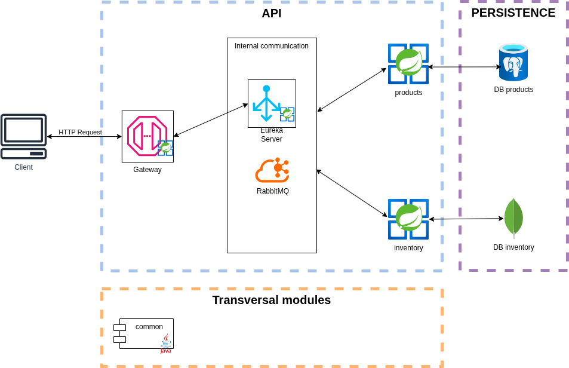
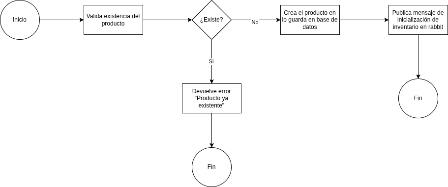
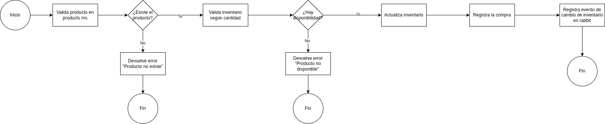
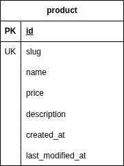
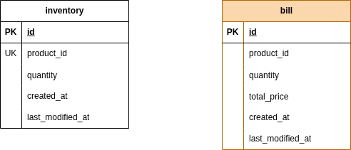

# Online Store API - Prueba Técnica Backend (Productos + Inventario)

Este repositorio implementa una solución basada en microservicios para la prueba técnica de backend, con dos servicios principales:

- `product`: gestión de productos.
- `inventory`: gestión de inventario y proceso de compra.

Adicionalmente, se incluye:

- `eureka-server`: descubrimiento de servicios.
- `common`: módulos compartidos (modelos, utilidades, errores, web común).
- `docker`: orquestación con Docker Compose.

## 1. Arquitectura

La solución sigue una arquitectura de microservicios con separación por responsabilidad:

- `product`
  - Expone endpoints para crear, consultar y listar productos.
  - Persiste en PostgreSQL.
- `inventory`
  - Expone endpoints para consultar/actualizar inventario y registrar compras.
  - Persiste inventario e historial de compras en MongoDB.
  - Se comunica con `product` vía HTTP para validar existencia/precio de producto.
- `eureka-server`
  - Registro y descubrimiento de instancias (`online-store-product`, `online-store-inventory`).

Comunicación entre microservicios:

- HTTP + JSON.
- Descubrimiento vía Eureka.
- API key en cabecera `X-API-KEY` para autenticación entre servicios.

## 2. Decisiones Técnicas y Justificación

### Lenguaje y framework
- Java 17 + Spring Boot + Gradle multi-módulo.

### Base de datos
- `product` en PostgreSQL:
  - Modelo relacional simple, con restricciones e índices naturales (slug único).
- `inventory` en MongoDB:
  - Flexibilidad para evolucionar historial de compras/eventos y documentos de inventario.

### Ubicación del endpoint de compra
El endpoint de compra se implementó en `inventory` (`/api/v1/bills/{productSlug}`), porque:

- La responsabilidad de validar stock y descontarlo pertenece al dominio de inventario.
- Reduce acoplamiento: `product` mantiene solo catálogo/precios.
- Permite consistencia de compra dentro del flujo transaccional del servicio de inventario.

## 3. Diagramas

### Arquitectura general


### Flujo de creación de producto


### Flujo de compra


### Modelo de datos - Producto


### Modelo de datos - Inventario


## 4. Endpoints principales

Base común: `/api/v1`

### Product service (puerto 8080)
- `POST /products` - Crear producto
- `GET /products/{slug}` - Obtener producto por slug
- `GET /products?page=&size=` - Listar productos

### Inventory service (puerto 8081)
- `GET /inventories/{productSlug}` - Consultar inventario por producto
- `PUT /inventories/{productSlug}` - Crear/actualizar inventario
- `POST /bills/{productSlug}` - Registrar compra (descuenta inventario)

## 5. Flujo de compra implementado

1. Cliente invoca `POST /api/v1/bills/{productSlug}` con cantidad.
2. `inventory` consulta `product` para validar existencia y obtener precio.
3. `inventory` valida stock disponible.
4. Si hay stock, descuenta inventario.
5. Calcula total (`precio * cantidad`) y registra la compra.
6. Retorna la compra registrada.

Manejo de errores de negocio:

- Producto inexistente: `C0002`.
- Inventario insuficiente: `I0001`.

## 6. Formato de respuesta

Se utiliza un contrato JSON uniforme:

- Éxito: `{ "ok": true, "data": ... }`
- Error: `{ "ok": false, "code": "...", "message": "..." }`

## 7. Ejecución local

### Prerrequisitos
- JDK 17
- Gradle Wrapper (incluido)
- PostgreSQL
- MongoDB

### Product
```bash
cd product
./gradlew :app:bootRun
```

### Inventory
```bash
cd inventory
./gradlew :app:bootRun
```

### Eureka Server
```bash
cd eureka-server
./gradlew :app:bootRun
```

## 8. Ejecución con Docker Compose

```bash
cd docker
podman compose up -d --build
```

Servicios publicados:

- Eureka: `http://localhost:8761`
- Product API: `http://localhost:8080`
- Inventory API: `http://localhost:8081`

## 9. Testing

### Product
```bash
cd product
./gradlew :service:test
```

### Inventory
```bash
cd inventory
./gradlew :service:test
```

Incluye pruebas unitarias para:
- creación y consulta de productos,
- gestión de inventario,
- flujo de compra,
- integración HTTP entre microservicios (mockeada).

## 10. Uso de IA durante el desarrollo

Se utilizaron herramientas de IA para:

- acelerar scaffolding de capas (controladores, servicios, mappers),
- proponer refactors y mejoras de diseño,
- generar/ajustar pruebas unitarias (AAA, nombres `should...`),
- apoyar troubleshooting de Docker/Eureka/serialización.

Validación de calidad del código generado:

- revisión manual de cada cambio,
- ejecución de pruebas automatizadas por módulo,
- ajuste iterativo sobre errores de compilación, wiring y comportamiento.

## 11. Mejoras y próximos pasos

### 11.1 Gateway como único punto de entrada

Aunque existe el proyecto `gateway`, actualmente los consumidores pueden invocar `product` e `inventory` directamente.  
Una mejora clara es usar el gateway como única entrada pública y enrutar internamente vía Eureka:

- rutas con `lb://online-store-product` y `lb://online-store-inventory`,
- centralización de autenticación/autorización,
- políticas transversales (CORS, rate limiting, versionado de API),
- estandarización de manejo de errores y trazabilidad.

### 11.2 Refactor de lógica de integración HTTP

La lógica de integración en `ProductsIntegrationServiceImpl` puede separarse para mejorar mantenibilidad y testabilidad:

- `RequestBuilder` para construir `HttpEntity`/headers/API key,
- `ResponseParser` para parsear respuestas de éxito/error (incluyendo `C0002`),
- cliente tipado (por ejemplo `ProductsClient`) para encapsular interacción con `RestTemplate`.

Esto reduce acoplamiento, simplifica pruebas unitarias y evita duplicación de código de integración.

### 11.3 Resiliencia entre microservicios

Para entornos más exigentes se recomienda incorporar:

- timeouts explícitos de cliente HTTP,
- reintentos con backoff para errores transitorios,
- circuit breaker/fallback para evitar cascadas de falla.

### 11.4 Observabilidad

Mejoras sugeridas para operación:

- logging estructurado (JSON),
- correlation/request id propagado entre servicios,
- métricas de negocio y técnicas por endpoint,
- health checks más completos y dashboards operativos.

### 11.5 Perfil aislado para pruebas de integración

Como mejora inmediata para estabilidad de CI/CD, se propone un perfil dedicado de integración (por ejemplo `it`) con infraestructura de pruebas desacoplada del entorno normal:

- `product`: base de datos en memoria (H2) para pruebas de endpoints.
- `inventory`: aislamiento de MongoDB para pruebas de integración (contenedor efímero o alternativa embebida).
- propiedades específicas para evitar side effects de infraestructura externa (por ejemplo deshabilitar Eureka en tests).

Esto permite ejecutar tests de integración de forma reproducible, rápida y sin dependencias del entorno local.
